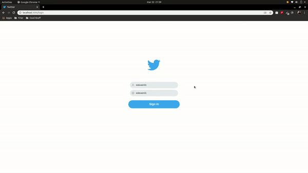

  
  <h1>Twitter clone</h1>

<a href="http://ec2-54-198-26-99.compute-1.amazonaws.com/"><strong style="font-size: 30px">Live demo</strong></a>

This is a simple project made with the purpose of testing the <a href="https://www.apollographql.com/docs/apollo-server/data/subscriptions/">GraphQL's Subscription</a> feature.

The focus of this project is the WebSocket comunication using <a href="https://www.apollographql.com/">Apollo</a> Server + Client with <a href="https://reactjs.org">React</a>, so I didn't spend much time with the interface and bugs.

Not recommended for < 1024px large screens.

<h1>Setup</h1>

- Make sure you have the latest version of <a href="https://nodejs.org">Node</a> and <a href="https://docker.com">Docker</a> installed.
- Change the name off the .env.example file on /backend to .env

> <strong>Linux / OSX</strong>

- Run `make install`
- Run `make up`

> <strong>Other OS</strong>

- Run a container with mongodb:`docker run -t twitter-db -p 27017:27107 -d mongo:latest`
- Make sure you have two terminal tabs open
- Run `yarn` on /frontend and /backend
- Run `yarn start` on /frontend on one tab and /backend on the other

<h1>Using</h1>

 
  

- Type any Name and Username
- Open a new browser window and "sign in" with another name and username
- See the real-time comunication between clients.
